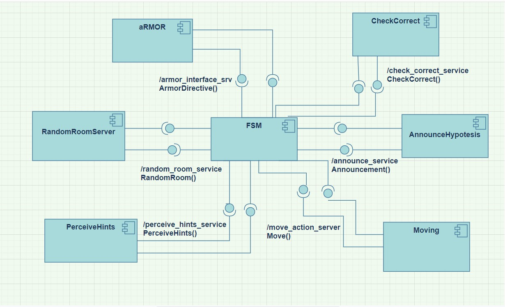
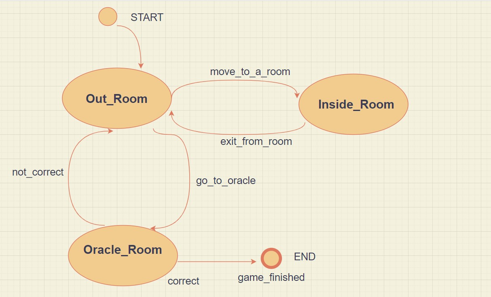
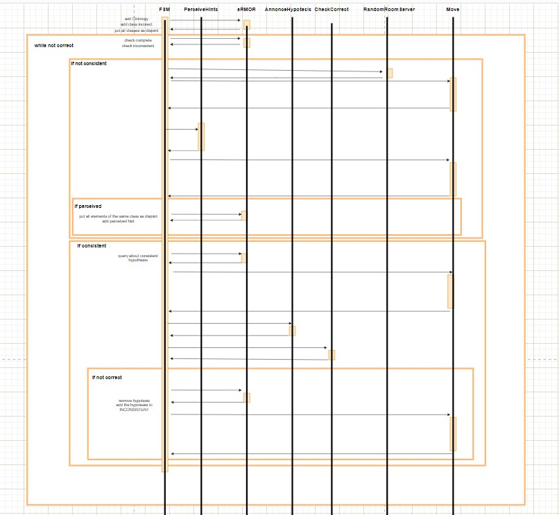
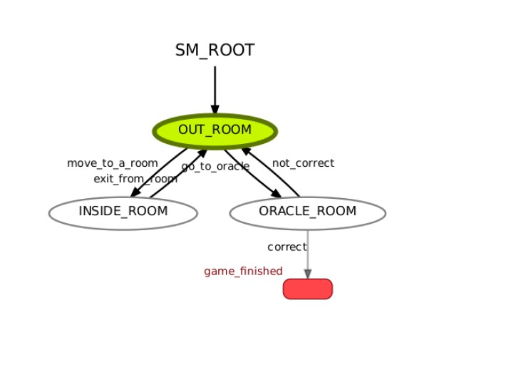
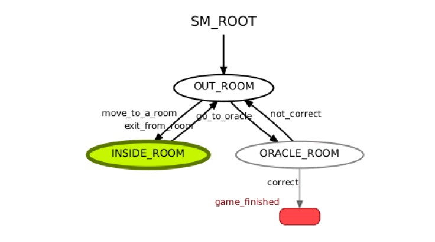
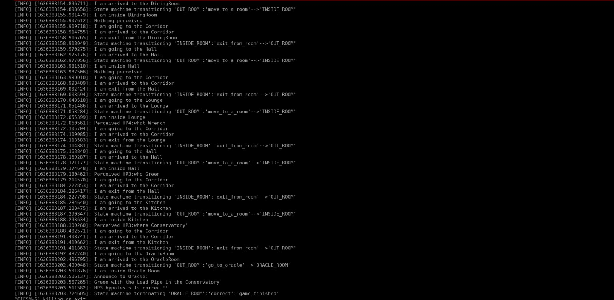
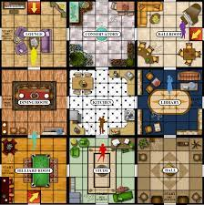

# Experimental Robotics Laboratory Course
## Assignment 1

## Brief introduction

The aim of this assignment is to design a software behavioural architecture which simulates an autonomous Cluedo game. The robot which is the player wants to find who is the murder, where he killed the victime and which weapon has been used. According to that it goes around to an appartement looking for hints, makes hypotesis about the murder and reasons about these. Once it finds a complete hypotesis (which must contains one person, one place and one weapon) it goes to the oracle room and asks if the hypotesis is correct. If hypotesis is not correct robot goes on looking for hints otherwise game finishes. The rooms, the people and the weapons of the game have been chosen accordig to the traditional game.

## Software architecture

The **component diagram** shows how the overall architecture is organized. It is possible to appreciate the modularity of the architecture. I have decided to divide as much as possible each functionality for giving the possibility to reuse and adapt the code in a future implementation. Below is presented the behaviour of each node:
- **FSM.py** is the core node of the architecture and it manages the sequence of the whole simulation. Inside that node it is possible to appreciate the Finite State Machine. 
- **RandomRoomServer.py** is a simple ROS service server which returns a random room between the possible ones belonging to the apartment.
- **PerceiveHints.py** is a ROS service server with the aim to simulate a specific the "looks around and perceiving hints" robot's behavior.
- **Announcement.py** is a ROS service server which simply announce to the Oracle the current consistent hypotesis.
- **CheckCorrect.py** is a ROS service server which check if the announced hypotesis is correct.
- **Moving.py** is a ROS action server which simulates the movement of the robot between the different rooms.

**aRMOR** is an already implemented [package](https://github.com/EmaroLab/armor), in particular it is a ROS service server used to manipulate ontologies. **FSM.py** is a service client of **aRMOR**, and through this service it communicates with the ontology.
Moreover each node communicate with the ROS Parameter Server. I have iserted three file of parameters:
- **Hints.yaml** contains all perceived hints in the simpler simulation. Each parameter in this file is call **hint** followed by a number. In that way is more easy to perceive randomly one hint.
- **Hints2.yaml** contains more hints and test the system in a challenging way. The simulation if this file is used take logically more time. Each hint is composed by the id of the hypotesis it belongs, the question specific to its class (who for PERSON or where for PLACE or what for WEAPON), and the item. 
- **rooms.yaml** contains the rooms of the apartment and thir location. Each parameter has as name **room** plus a number. For the same reason above. Each param is composed by the name of the room and its position (x,y) in the apartment.
- **gamesession.yaml** contains the information about the specific game session robot is playing. In particular the link of the ontology and its path in the workspace are provided respectively by parameters **ontology** and **ontology_path**. The id of the correct hypotesis is inside **correct_hypotesis** param whereas the id of the consistent hypotesis that robot wants to check is inside **current_hypotesis** one. The number of all hints and rooms are respectively contained by parameters **no_hints** and **no_rooms**.

In the component diagram the structure of the hierarchical architecture. In particular the core module, the perception modules, the action modules, an the reasoning one are separated. Moreover generally the robot perceive an hints, reason about that hints, decide for the next action and acts. The more relevant difference with a standard hierarchical architecture is the communication protocol used. Generally the perception and the action modules communicate with the reasoning planning one through publisher-subscriber communication protocol. There I have decide to use only service-client
 and action communications protocols. Logically these nodes on real robot scenario or in simulation should use pub/sub in order to get information from sensor and send informations to motors or microphones for example. \
To conclude about the component diagram different custom services and messages has been defined:
- **RandomRoom** has an empty request and returns the parameter name of the room randomly chosen.
- **PerceivedHints** has an empty request and retrieve firstly an integer which is 0 if nothing has been perceived otherwise is 1. Then the perceived hint if any, its hypotesis'ID and the question related to the class the hint belogs .
- **Announcement** has as request the hints to announce. One people, one place and one weapon. The response is simply a boolean.
- **ChecKCorrect** has as request the ID of hypotesis that robot want to check if it is true or false. It return True if it is correct otherwise False.
- **Move** is a custom action which as goal has the room destination. The actual (x,y) and the goal (x,y). It has as feedbachk the actual position (x,y,theta) when robot moving. The result is a boolean.
 
To conclude in the package it is possible to find the ontology in the file **cluedo_ontology.owl**, moreover at the end of each game session the new ontology with inference is saved on file **cluedo_ontology_inference.owl**.

The **states diagram** depicts the three possible states of the robot which has been implemented in **FSM.py** through **Smach**. The first state is **Out_Room** which assumes the robot in the Corridor. From this state if there are no consistent hypotesis it pass in **Inside_Room** state otherwise in **Oracle_Room** state. In **Inside_Room** state robot look for one hint then it exit from the room and return to the Corridor. When the robot is in **Oracle_Room** state it ask if the current consistent hypotesis is correct if it is the game is finished otherwise it return to **Out_Room** seraching from hint. In the diagram each name regarding both states and transitions have been chosen according to the respective one inside the code\

In the **sequence diagram** it is possible to see the behaviour of the overall system.
- Robot check for a new consistent hypotesis:
- If there are not:
   1. look for a random room
   2. move to that room
   3. look to a new hint
   4. return to the corridor
   5. if an hint has been perceived it reason about this and if it is belong to a hypotesis not uncorrect it add it to the ontologuìy
   6. return to check if there is a new consistent hypotesis
- If there are:
   1. find the ID of that hypotesis
   2. move to the Oracle room
   3. annonce the hypotesis
   4. check if it is correct
   5. if it is correct exit to the game
   5. if it is not it adds the hypotesis to the INCORRECT class
   6. it return to the corridor
   7. return to check if there is a new consistent hypotesis

## Installation and running procedures

Clone the [exprob_ass1 repository](https://github.com/AliceNardelli/exprob_ass1) and build the workspace.
In one terminal run the ros master and then the ontology: 
> rosrun armor execute it.emarolab.armor.ARMORMainService 

On another terminal launch the overall sistem: 

> roslaunch exprob_ass1 cluedo_game_session.launch 

If you want to use the simulation with more hints goes in the **gamesession.yaml** file and change param **no_hints** with 28 and **correct_hypotesis** with HP6. Then goes in the cited launch file and load **Hints2.yaml** instead **Hint.yaml**. 
In order to see how Finite state Machine evolves in time run: 

> rosrun smach_viewer smach_viewer.py

## Relevant part to running code
As I have already say the orchestration between component done by **FSM.py** is certainly the core of the running code. For having a more clear idea about how simulation works run **smach_viewer** is certainly an idea.
The two images belows shows how finite state machine looks like when robot is in Out_Room and Inside_Room states. Moreover **log.txt** is the logfile of the whole simulation and givev a clear idea about the workflow. Another game_simulation has been captured inside the screen below.

## Working hypothesis and environment 

1. The model of the apartment is arranged in a matrix. Rooms are organized in a 3x3 matrix fashioned the figure below. The position of each room is correlated to the cell of the matrix corrersponding to that room. Rows and columns start enumerate from up left corner. For example the Lounge correspond to (1,1) coordinates whereas Library to (2,3). The Corridor is assumed to be at (0,0) posistion whereas the Oracle room at (10,10). I think that this model gives an hight level of abstraction and certainly gives the possibility to integrate a navigation module. For example it would be necessary a map in which each room is a waypoint stored in a new parameters file. Logically it would be also necessary a path planning algorithm and integrate also the obstacle avoidance module.
Image below shows the arangement of rooms in the apartment that I have organized into a matrix.\

2. The robot is assumed to be a point (x,y). The movement is modeled as a wayting procedure. The robot moves in a straight line from the start to the goal point with a constant speed 1 m/s. The wayting
procedure is calculate according to that assuption. I have decided to use the action server because a durative action is a better choice than an instant one to model movement. This is particurlarly important if the node needs to be integrated with a simulation. For this last reason I have decide to model the movement in the simpler possibile way giving anyway a feedback which is an important aspect to consider in a future implementation. Moreover an action can be stopped if needed, this allows the robot additional behavior such as to change the room when it is moving if called by a person.
3. The robot is considered inside a room when after the moving procedure it passes from **Out_Room** state to the next state **Inside_Room** or **Oracle_Room** on the opposite side works when it exit from the room. The Corridor is considered out from any room. The robot when it enter in a room it simply announce where it actually is logging the information. Logically it is possible to store this information inside a variable. For example a bit array long as the number of room in which each cell is associated to a room and the value inside the cell is 1 if the robot is inside that specific room, 0 otherwise. This structure can be shared to the overall architecture through a publisher. I have decided to not implement that because I think at this level is useless. On the opposite side in the **FSM.py** is shared between different classes a variable which store the actual room and this is the starting point of that implementation.
4. The ontology provided by Professor is used to reason about hypotesis. HYPOTESIS is a class, an hypotesis is considered COMPLETE when it has at least three element, a complete hypotesisis is considered INCONSISTENT if there are at least two elements belonging to the same class. According to that an hypotesis is considered CONSISTENT if it has one PERSON, one WEAPON, one PLACE. I have decided to add one class which is INCORRECT. When the robot is inside the Oracle Room and understand that a consistent hypotesis is not correct it add it before removes it, then it add to the uncorrect class. In such a way if it perceives an hints beloging to an hypotesis that has been already checked as not correct it discard it. Logically this behaviour should be simply implemented with a list but this choice is used if in future implementation is needed to reason deeper on hypotesis.
5. The overall behavior is based on the idea of randomness. The room where robot moves are chosen randomly. The hints are perceived or not randomly too, the possibility of not perceive an hint is always 1/4. Logically it is possible also to randomize this aspect. Moreover the hints are chosen randomly from the available parameters. A possible improvements about this aspect is to extract hints only once without the possibility of extract them again. This is possible using an array in which already extracted hints are selected. I have preferred play a bit with aRMOR adding a new class.
6. The announcement is simply a server that if called print the sentence on terminal. Logically in a real robot case the message should be published as text to speech message on robot microphone.
7. The Oracle is modeled as one a place where the robot goes and announce the hypotesis and check if correct. In a real case scenario this behavior should be implemented as a waypoint in the map where the robot should go and where is located a person with which the robot should dialog. The Oracle is considered to know the correct hypotesis and the hints belonging to each hypotesis given a specific id.
8. A possible improvement is for example find differents way to perceive hints for example speak with someone or see something. The architecture should chose randomly between these possible behaviors. 
9. The robot collect only one hint each time and then check if there is a consistent hypotesis. A simple modification should be collect a random number of hints and the check consistency. This is possible through a variable counter shared by **Out_Room** and **Inside_Room** state. I think the two options are more or less equivalent
10. **RandomRoomServer.py** at this level of implementation is useless. It can be easly replaced with a function on the **FSM.py**. I have decided to divide this module firsly because I think it has a specific purpose different from the state machine aim. Moreover in a future should be replace with a specific behavior, for example if the robot decide the room to visit asking to someone.
    

## Author and Contact
**Alice Nardelli**
**s4528692**
**alice.nardelli98@gmail.com**
**4528692@studenti.unige.it**

